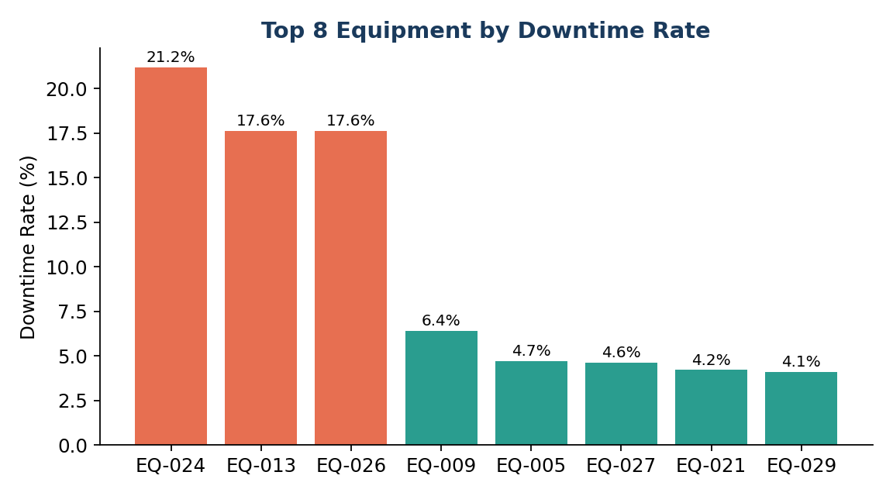
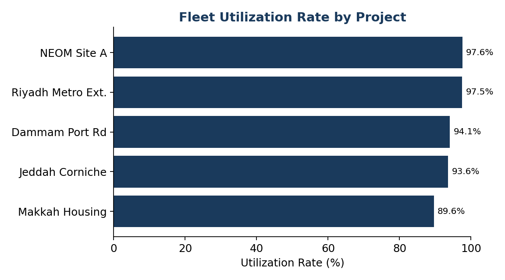
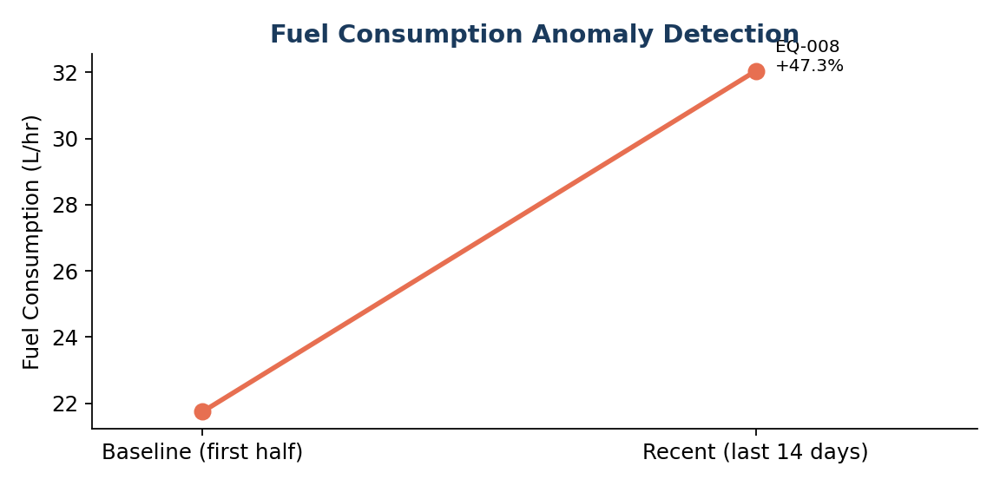

# FleetOps AI

> **AI Operations Agent for Construction Equipment**

FleetOps AI is a data-driven operations assistant that turns construction-equipment telemetry into actionable fleet insights.

Instead of manually reviewing spreadsheets for downtime, fuel consumption, maintenance activity, and utilization, fleet managers can explore the fleet through a dashboard or ask questions in natural language.

The project combines **Python data analytics, machine learning, an LLM-powered agent, and Streamlit** into one end-to-end prototype.

---

## ✨ Key Features

- 📊 **Fleet Operations Dashboard**
  - Fleet size
  - Overall utilization
  - Operating hours
  - Fuel consumption
  - Downtime analysis
  - Project-level utilization

- 💬 **Natural-Language AI Agent**
  - Ask operational questions in English or Arabic
  - Routes questions to the appropriate analytical tool
  - Supports both LLM mode and a local rule-based test mode

- 🚨 **Equipment Attention Detection**
  - Identifies equipment requiring operational attention
  - Combines downtime, fuel deviation, and maintenance frequency
  - Compares fuel performance within equipment type for fairer analysis

- 🤖 **Machine Learning Anomaly Detection**
  - Isolation Forest
  - Multi-feature anomaly detection
  - Unified Attention Score from 0–100

- ⛽ **Fuel Anomaly Detection**
  - Compares recent fuel efficiency with each equipment unit's historical baseline
  - Detects abnormal increases or decreases

- 📋 **Fleet Performance Reporting**
  - Project-level performance
  - Top downtime issues
  - Fuel alerts
  - Downloadable CSV report

- 📂 **Custom Dataset Upload**
  - Upload equipment and daily-operation CSV files
  - Run the same analysis pipeline on another dataset

- 🧪 **Automated Testing**
  - Data integrity checks
  - KPI validation
  - Fuel anomaly validation
  - ML cross-validation
  - Agent routing tests
  - Edge-case tests
  - Output-file checks

---

## 🏗️ Architecture

```text
                    ┌─────────────────────┐
                    │   CSV Fleet Data    │
                    │ Equipment + Logs    │
                    └──────────┬──────────┘
                               │
                               ▼
                    ┌─────────────────────┐
                    │ Data Processing &   │
                    │ KPI Calculations    │
                    │ Pandas / NumPy      │
                    └──────────┬──────────┘
                               │
              ┌────────────────┼────────────────┐
              │                │                │
              ▼                ▼                ▼
      ┌──────────────┐ ┌──────────────┐ ┌──────────────┐
      │ KPI / Rules  │ │ ML Detection │ │ Fuel Analysis│
      │    Tools     │ │ Isolation    │ │   Baseline   │
      │              │ │ Forest       │ │  Comparison  │
      └──────┬───────┘ └──────┬───────┘ └──────┬───────┘
             │                │                │
             └────────────────┼────────────────┘
                              ▼
                    ┌─────────────────────┐
                    │     AI Agent        │
                    │ Tool Selection +    │
                    │ Natural Language    │
                    └──────────┬──────────┘
                               │
                    ┌──────────▼──────────┐
                    │     Streamlit       │
                    │      Dashboard      │
                    └─────────────────────┘
```

---

## 🧰 Tech Stack

| Area | Technology |
|---|---|
| Language | Python |
| Data Analysis | Pandas, NumPy |
| Machine Learning | Scikit-learn |
| Anomaly Detection | Isolation Forest |
| AI / LLM | OpenAI API |
| Agent Tools | Function / Tool Calling |
| Dashboard | Streamlit |
| Visualization | Plotly, Matplotlib |
| Data Format | CSV |
| Testing | Custom Python test suite |
| Documentation | Markdown, PDF, PPTX |

---

## 📁 Project Structure

```text
fleetops-ai/
│
├── app/
│   └── main.py
│
├── data/
│   ├── equipment_master.csv
│   ├── fleet_daily_logs.csv
│   ├── equipment_kpis.csv
│   └── weekly_utilization_by_project.csv
│
├── notebooks/
│   └── FleetOps_EDA.ipynb
│
├── reports/
│   ├── chart_top_downtime.png
│   ├── chart_fuel_anomaly.png
│   ├── chart_utilization_by_project.png
│   ├── FleetOps_AI_Project_Report.pdf
│   ├── FleetOps_AI_Test_Report.pdf
│   └── test_results.json
│
├── presentation/
│   ├── FleetOps_AI_Presentation.pptx
│   └── Demo_Video_Script.md
│
├── src/
│   ├── agent.py
│   ├── tools.py
│   ├── ml_anomaly.py
│   ├── kpis.py
│   ├── generate_data.py
│   ├── make_charts.py
│   ├── test_suite.py
│   ├── build_report.py
│   ├── build_test_report.py
│   └── build_presentation.js
│
├── requirements.txt
└── README.md
```

---

## 📊 Dataset

The repository includes a **synthetic prototype dataset** containing:

- 30 equipment units
- 90 days of daily operational records
- 5 construction projects
- Equipment types such as excavators, loaders, dump trucks, graders, cranes, and bulldozers
- Operating hours
- Downtime hours
- Fuel consumption
- Maintenance events

The dataset intentionally contains several operational patterns so that the analytics and anomaly-detection pipeline can be demonstrated and validated.

### Important

The included data is **synthetic**, not confidential operational data from a real fleet.

The application can also accept external datasets using the required CSV schema described below.

---

## 🔎 Core Analytics

### 1. Utilization Rate

```text
Utilization =
Operating Hours
------------------------------- × 100
Operating Hours + Downtime Hours
```

### 2. Downtime Rate

```text
Downtime Rate =
Downtime Hours
------------------------------- × 100
Operating Hours + Downtime Hours
```

### 3. Fuel Efficiency

```text
Fuel Efficiency =
Fuel Consumption (L)
-------------------
Operating Hours
```

### 4. Fuel Deviation

Fuel performance is compared primarily against the average of the same equipment type rather than the entire fleet.

This helps avoid treating naturally fuel-intensive equipment as anomalous simply because it consumes more fuel than a different equipment category.

### 5. ML Anomaly Detection

The project uses **Isolation Forest** with multiple operational features, including:

- Downtime rate
- Fuel deviation from equipment-type average
- Maintenance frequency
- Operating hours

### 6. Attention Score

The dashboard combines multiple signals into a single 0–100 operational priority score.

The current prototype combines:

- Downtime rate — 40%
- Fuel deviation — 25%
- Maintenance frequency — 20%
- ML anomaly signal — 15%

> The score is a prototype prioritization mechanism, not a safety-critical decision system.

---

## 💬 AI Agent

The agent supports two execution modes.

### Real Mode

When an OpenAI API key is configured, the agent uses an LLM with tool calling to:

1. Understand the user's question
2. Select an analytical tool
3. Execute the tool
4. Return the tool result to the model
5. Generate a natural-language response grounded in the returned data

### Test Mode

Without an API key, the project runs a local keyword-based router.

This makes it possible to test the complete analytical pipeline without requiring an external API call.

Example questions:

```text
Which equipment has the highest downtime?

Which equipment needs urgent attention?

Why did utilization drop?

What's causing the fuel increase?

Generate a fleet performance report.

Give me a unified priority ranking.
```

Arabic questions are also supported by the current router.

---

## ▶️ Getting Started

### 1. Clone the repository

```bash
git clone <YOUR_GITHUB_REPOSITORY_URL>
cd fleetops-ai
```

### 2. Create a virtual environment

Windows:

```bash
python -m venv .venv
.venv\Scripts\activate
```

macOS / Linux:

```bash
python3 -m venv .venv
source .venv/bin/activate
```

### 3. Install dependencies

```bash
pip install -r requirements.txt
```

### 4. Run the dashboard

```bash
streamlit run app/main.py
```

The application should open in your browser.

---

## 🔐 Optional: Enable the LLM

For local development, configure your OpenAI API key through an environment variable.

Example:

```bash
OPENAI_API_KEY=your_api_key_here
```

Do **not** commit the API key to GitHub.

Without the key, FleetOps AI automatically runs in Test Mode.

---

## 🧪 Run the Test Suite

From the project root:

```bash
python src/test_suite.py
```

The test suite validates:

- Dataset integrity
- KPI calculation accuracy
- Fair fuel comparison
- Known fuel anomaly detection
- ML anomaly overlap with manual analysis
- AI-agent routing
- Empty and invalid input handling
- Generated report files

The current project test run produced:

```text
16 tests
16 passed
0 failed
```

---

## 🧮 Regenerate the Dataset and KPIs

To regenerate the synthetic dataset:

```bash
python src/generate_data.py
```

Then recalculate the KPI files:

```bash
python src/kpis.py
```

Generate charts:

```bash
python src/make_charts.py
```

> Regenerating the synthetic data may change the exact numerical results shown in the existing reports.

---

## 📂 Custom Data Format

The dashboard supports uploading two CSV files.

### `equipment_master.csv`

Required columns:

```text
equipment_id
equipment_type
project
```

### `fleet_daily_logs.csv`

Required columns:

```text
date
equipment_id
equipment_type
project
operating_hours
downtime_hours
fuel_consumption_l
maintenance_flag
```

The two datasets are joined using:

```text
equipment_id
equipment_type
project
```

---

## 📈 Example Outputs

### Downtime Analysis



### Utilization by Project



### Fuel Anomaly Detection



---

## 📦 Project Deliverables

The repository includes supporting project artifacts:

| Deliverable | Location |
|---|---|
| Source code | `src/` + `app/` |
| Synthetic dataset | `data/` |
| EDA notebook | `notebooks/FleetOps_EDA.ipynb` |
| Project report | `reports/FleetOps_AI_Project_Report.pdf` |
| Test report | `reports/FleetOps_AI_Test_Report.pdf` |
| Test results | `reports/test_results.json` |
| Presentation | `presentation/FleetOps_AI_Presentation.pptx` |
| Demo script | `presentation/Demo_Video_Script.md` |

---

## ⚠️ Current Limitations

This is a prototype designed to demonstrate an AI-assisted fleet-operations workflow.

Current limitations include:

- The included dataset is synthetic.
- The Attention Score weights are manually defined.
- Isolation Forest results depend on the selected feature set and contamination parameter.
- Fuel anomaly detection uses a historical baseline rather than a dedicated time-series forecasting model.
- The local Test Mode router uses keyword matching and is intentionally simpler than the LLM agent.
- The current application is not intended to replace engineering inspection, maintenance procedures, or safety systems.

---

## 🚀 Future Improvements

Potential next steps include:

- Real fleet / IoT / telematics integration
- Time-series forecasting for utilization and fuel consumption
- Automated maintenance prediction
- Equipment failure prediction
- Role-based access control
- Database-backed storage
- Production-grade API layer
- More robust dataset validation
- Model monitoring and evaluation
- Explainable ML dashboards
- Deployment with secure secret management
- Automated CI/CD testing

---

## 🏆 Project Context

FleetOps AI was developed as a prototype for the:

**15th China International College Students' Innovation & Entrepreneurship Competition**

Track:

**AI + Construction Machinery → AI + Operations**

The project explores how AI agents can make operational analytics more accessible by connecting natural-language questions with deterministic data-analysis tools and machine-learning signals.

---

## 📄 License

This repository is currently provided as a project prototype.

If the project is published publicly, add an explicit license such as MIT, Apache-2.0, or another license appropriate to the project and its contributors.

---

## 👤 Author / Team

**FleetOps AI Team**

Built with Python, Streamlit, Scikit-learn, Pandas, and OpenAI tool calling.
